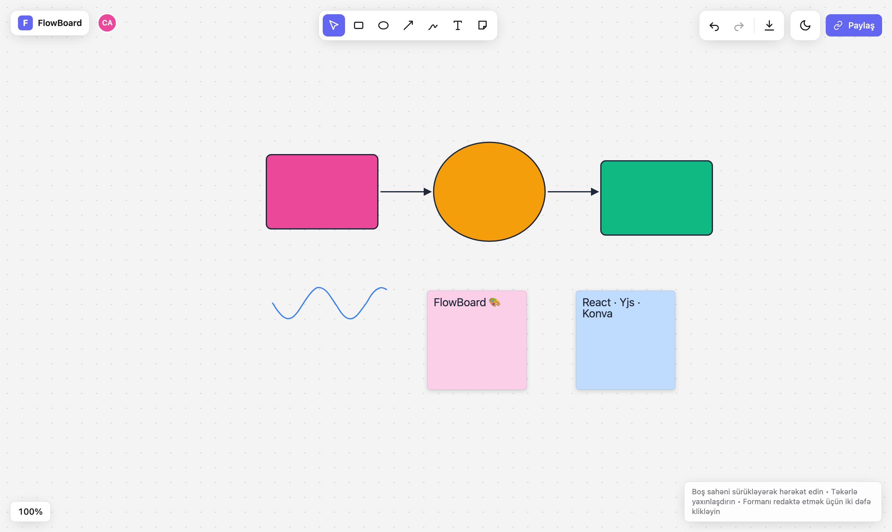
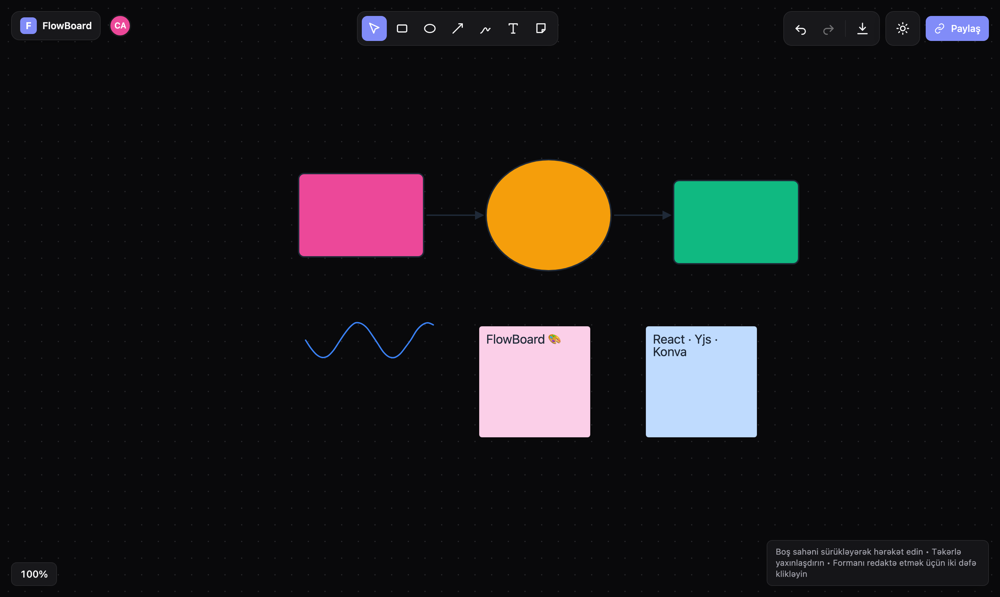
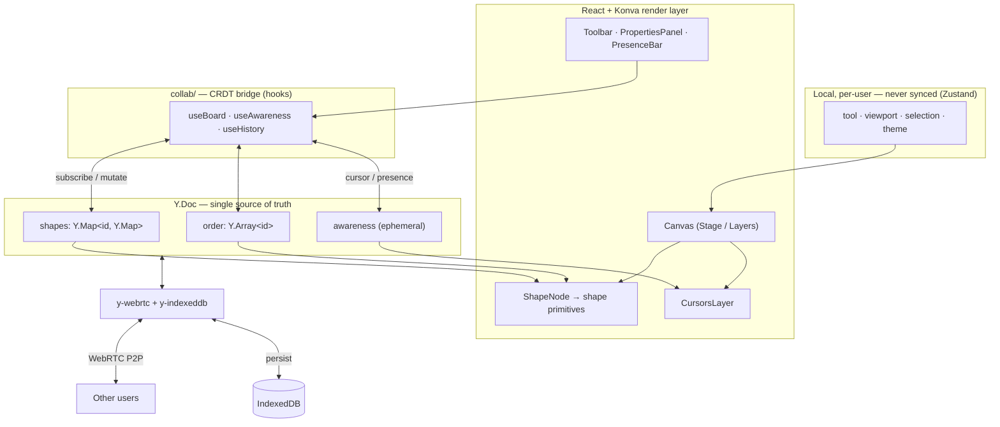

# 🎨 FlowBoard

> A real-time, multiplayer, infinite-canvas whiteboard — a lightweight Excalidraw / Miro clone built with React, TypeScript, Yjs (CRDT) and Konva.

FlowBoard lets several people draw, add shapes, text and sticky notes, and see
each other's live cursors on the same infinite canvas. State is synchronised
peer-to-peer with **conflict-free CRDTs**, persisted offline in the browser, and
rendered on a hardware-accelerated `<canvas>`.

<p align="center">
  <em>Built as a portfolio piece to demonstrate real-time systems, CRDT data modelling, and clean front-end architecture.</em>
</p>

---

## 📸 Demo

> _Placeholder — replace with your own captures._

|                       Drawing & editing                       |                    Real-time collaboration                    |
| :-----------------------------------------------------------: | :-----------------------------------------------------------: |
|  <br> _`docs/demo-drawing.gif`_ |  <br> _`docs/demo-collab.gif`_ |

|                    Light theme                     |                     Dark theme                     |
| :------------------------------------------------: | :------------------------------------------------: |
|  <br> _`docs/screenshot-light.png`_ |  <br> _`docs/screenshot-dark.png`_ |

---

## ✨ Features

- **♾️ Infinite canvas** with smooth zoom (to cursor) and pan.
- **🧰 Tools** — select/move, rectangle, ellipse, arrow, freehand pen, text, sticky note.
- **✏️ Shape editing** — drag, resize & rotate (Konva Transformer), delete, change fill / stroke colour and stroke width.
- **↩️ Full undo / redo** history via `Y.UndoManager` — scoped so you only undo _your own_ changes.
- **👥 Real-time sync** — share the room URL and everyone edits the same board live (CRDT, no data loss on concurrent edits).
- **🖱️ Live cursors** — see other users' cursors with their name & colour, in real time.
- **⌨️ Keyboard shortcuts** — fast tool switching and history.
- **🌗 Light / dark theme** — persisted across sessions, no flash on load.
- **💾 Offline persistence** — work is saved to IndexedDB and restored automatically.
- **🖼️ PNG export** — download the canvas as an image.
- **♿ Accessible & responsive** — semantic controls, `aria` labels, keyboard-focusable, touch-friendly.

### ⌨️ Keyboard shortcuts

| Key            | Action        | Key                | Action        |
| -------------- | ------------- | ------------------ | ------------- |
| `V`            | Select / move | `T`                | Text          |
| `R`            | Rectangle     | `S`                | Sticky note   |
| `O`            | Ellipse       | `Ctrl/⌘ + Z`       | Undo          |
| `A`            | Arrow         | `Ctrl/⌘ + Shift+Z` | Redo          |
| `P`            | Pen           | `Delete` / `Backspace` | Delete selection |
| `Esc`          | Deselect      |                    |               |

---

## 🛠️ Tech stack

| Concern              | Choice                        | Why                                                                             |
| -------------------- | ----------------------------- | ------------------------------------------------------------------------------- |
| UI framework         | **React 18 + TypeScript**     | Component model + full type safety.                                             |
| Build tool           | **Vite**                      | Instant HMR, fast production builds.                                            |
| Canvas rendering     | **Konva.js / react-konva**    | Declarative, high-performance 2D scene graph with hit-testing & transformers.  |
| Real-time / CRDT     | **Yjs**                       | Battle-tested CRDT — conflict-free concurrent editing.                          |
| Transport            | **y-webrtc**                  | Peer-to-peer sync with **no backend server** — ideal for a zero-infra demo.     |
| Offline persistence  | **y-indexeddb**               | Transparently saves & restores the document locally.                           |
| Local UI state       | **Zustand**                   | Tiny, hook-based store for per-user state (tool, viewport, selection, theme).   |
| Styling              | **Tailwind CSS**              | Utility-first styling with a token-driven theming layer.                       |
| Quality              | **ESLint + Prettier + tsc**   | Consistent, statically-checked, formatted code.                                |

> **Why y-webrtc instead of y-websocket?** The brief allowed falling back to
> WebRTC so the demo needs no backend. Peers discover each other through public
> signaling servers, then sync **directly**. Swapping in `y-websocket` later is a
> one-file change in [`src/collab/doc.ts`](src/collab/doc.ts).

---

## 🏛️ Architecture

The central design decision is a strict separation of **three kinds of state**,
because each has different sync & persistence semantics:

| Layer                | Holds                                   | Tool            | Synced? | Persisted?          |
| -------------------- | --------------------------------------- | --------------- | :-----: | :-----------------: |
| **Shared document**  | Shapes, their properties, z-order       | Yjs `Y.Doc`     |   ✅    | ✅ (IndexedDB)      |
| **Presence**         | Cursors, user name/colour               | Yjs `awareness` |   ✅    | ❌ (ephemeral)      |
| **Local UI state**   | Active tool, zoom/pan, selection, theme | Zustand         |   ❌    | ⚠️ theme only       |



### Data model

Every shape is a **discriminated union** on a `type` field (see
[`src/types/index.ts`](src/types/index.ts)), giving exhaustive compile-time
safety. All coordinates are stored in **world space**; the zoom/pan transform is
applied only at render time on the Konva `Stage`.

The Yjs document is structured as:

```
Y.Doc  (one room = one document)
├── shapes : Y.Map< shapeId, Y.Map<field, value> >   ← each shape is a NESTED Y.Map
├── order  : Y.Array< shapeId >                       ← z-order, bottom → top
└── meta   : Y.Map                                    ← room metadata
```

**Why a nested `Y.Map` per shape** (rather than a plain JSON object)? It makes
merges **field-level**: if one user moves a shape (`x`/`y`) while another recolours
it (`fill`), _both_ edits survive. A plain object would overwrite wholesale
(last-writer-wins), losing a change. Z-order uses a `Y.Array` of ids so
concurrent reordering also merges cleanly.

### Project structure

```
src/
├── canvas/                 # Konva render layer ("how it's drawn")
│   ├── Canvas.tsx          # Stage, pointer interactions, tools, PNG export
│   ├── useViewport.ts      # zoom-to-cursor logic
│   ├── SelectionTransformer.tsx
│   ├── CursorsLayer.tsx    # live cursors
│   ├── TextEditor.tsx      # HTML overlay for text/sticky editing
│   └── shapes/ShapeNode.tsx
│
├── collab/                 # Real-time / CRDT layer ("how it's synced")
│   ├── doc.ts              # Y.Doc + y-webrtc + y-indexeddb wiring
│   ├── schema.ts           # typed Y.Map ⇄ Shape converters
│   ├── roomContext.ts      # React context + subscription helper
│   ├── RoomProvider.tsx    # provider + UndoManager
│   ├── useBoard.ts         # reactive shapes + mutations
│   ├── useAwareness.ts     # presence / cursors
│   └── useHistory.ts       # undo / redo
│
├── store/                  # Local UI state (Zustand)
│   ├── useToolStore.ts     ├── useViewportStore.ts
│   ├── useUIStore.ts       ├── useSelectionStore.ts
│   └── useCanvasApi.ts
│
├── ui/                     # Presentational components (Tailwind)
│   ├── Toolbar.tsx         ├── PropertiesPanel.tsx  ├── PresenceBar.tsx
│   ├── ShareButton.tsx     ├── ThemeToggle.tsx      ├── HistoryControls.tsx
│   ├── ZoomIndicator.tsx   ├── IconButton.tsx       └── icons.tsx
│
├── lib/                    # Pure helpers (no React)
│   ├── shapes.ts (factories)  ├── geometry.ts  ├── colors.ts
│   ├── names.ts               ├── room.ts       └── id.ts
│
├── hooks/                  # useKeyboardShortcuts, useWindowSize
├── types/                  # shared domain types
├── App.tsx                 # app shell + layout
└── main.tsx                # entry point
```

---

## 🚀 Getting started

**Prerequisites:** Node.js ≥ 18 and npm.

```bash
# 1. Install dependencies
npm install

# 2. Start the dev server
npm run dev
# → open the printed URL (e.g. http://localhost:5174)

# 3. Collaborate
#    Copy the room URL (the "Paylaş" / Share button) and open it in another
#    browser window or send it to a teammate — you're now on the same board.
```

### Other scripts

```bash
npm run build         # type-check (tsc -b) + production build to dist/
npm run preview       # preview the production build locally
npm run lint          # ESLint (zero warnings enforced)
npm run format        # Prettier — write
npm run format:check  # Prettier — check
```

---

## 🧭 How real-time collaboration works

1. The room id lives in the URL hash (`/#<roomId>`); if absent, a new one is
   generated so every visitor gets a shareable link instantly.
2. `y-webrtc` uses that id as the room name — peers find each other via public
   signaling servers and then sync the `Y.Doc` **directly, peer-to-peer**.
3. `y-indexeddb` mirrors the same document to the browser so your work is
   available offline and restored on reload.
4. Live cursors and identities travel over Yjs **awareness** (ephemeral state) —
   they are never written to the persistent document.

---

## 🗺️ Roadmap / next steps

- [ ] **Self-hosted `y-websocket` server** option for reliable large rooms.
- [ ] **Marquee (rubber-band) multi-select** and group operations.
- [ ] **Image / file drop** onto the canvas.
- [ ] **More shapes** — lines, diamonds, connectors that snap to shapes.
- [ ] **Layers panel** & z-index controls (send to back / bring to front UI).
- [ ] **Comments / reactions** anchored to canvas positions.
- [ ] **Export to SVG** and copy-to-clipboard.
- [ ] **Auth & named rooms** with access control.
- [ ] **Unit + E2E tests** (Vitest + Playwright).

---

## 📄 License

[MIT](LICENSE) © 2026 FlowBoard
